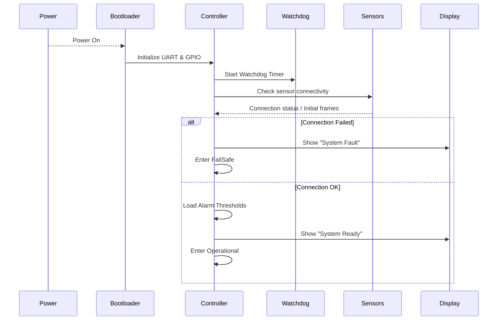
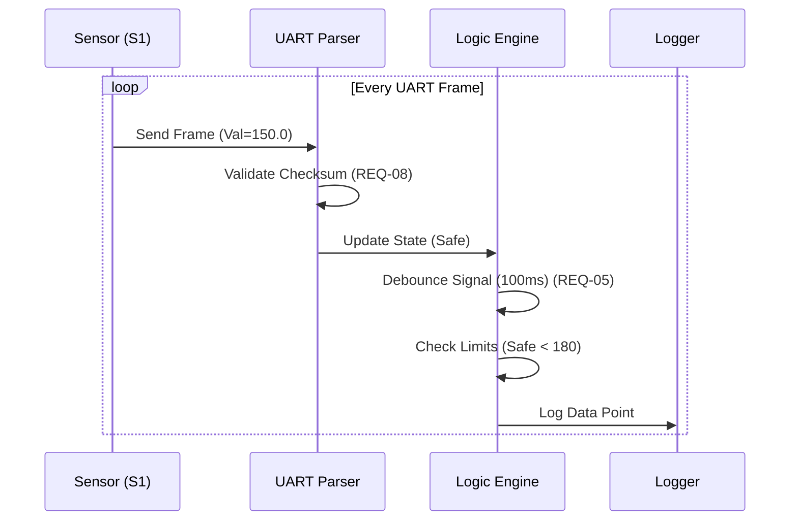
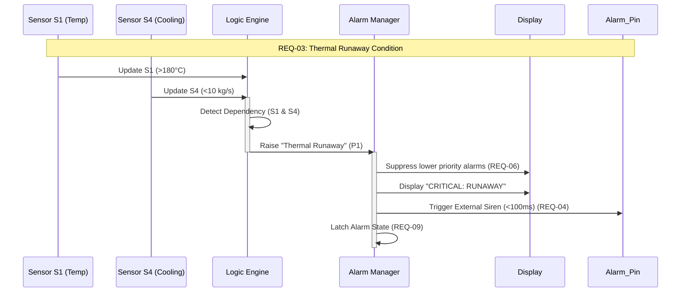
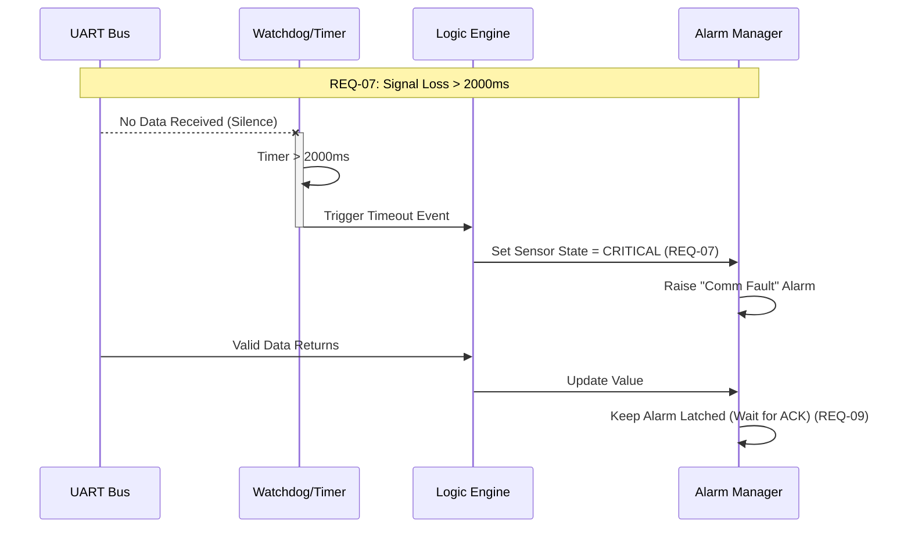

## 1. Key Sequence Diagrams

### SD-1: System Start-up & Initialization
*Verified against REQ-01 and System Context.*

---

### SD-2: Normal Sensor Monitoring (Sunny Day)
*Verified against REQ-01, REQ-05, and REQ-08.*

---

### SD-3: Safety-Critical – Thermal Runaway
*Verified against REQ-03, REQ-04, and REQ-06.*

---

### SD-4: Fault Recovery – Signal Loss
*Verified against REQ-07 and UC-5.*

---

## 2. Traceability Matrix

| Requirement | Statechart Element(s) | Sequence Diagram(s) | Test ID |
|:---|:---|:---|:---|
| **REQ-01** Latency < 50ms | Operational (Loop) | SD-2 | T-1 |
| **REQ-02** S1 Critical > 200°C | Sensor Evaluation | SD-2 | T-2 |
| **REQ-03** Thermal Runaway | Dependency Engine | SD-3 | T-3 |
| **REQ-06** Alarm Suppression | Lifecycle Manager | SD-3 | T-4 |
| **REQ-07** Signal Loss > 2s | FailSafe / Timeout | SD-4 | T-5 |
| **REQ-09** Latching Alarms | Lifecycle Manager | SD-4 | T-6 |

---

## 3. Test Plan

### T-1: System Latency Check
* **Related Requirements**: REQ-01: Update internal state machine within 50ms.
* **Purpose**: Verify the system processes inputs within the deterministic deadline.
* **Preconditions**: System in `Operational` state; UART simulator connected.
* **Stimulus**: Inject a valid UART frame with a specific timestamp.
* **Test Steps**:
    1. Send timestamped frame `$SENSOR,ID=S1,VAL=100,TS=1000`.
    2. Monitor internal state variable update time.
* **Expected Outcome**: Internal state is updated < 50ms after frame injection.
* **Pass/Fail Criteria**: PASS if delta < 50ms; FAIL otherwise.

### T-2: Threshold Classification (Sunny Day)
* **Related Requirements**: REQ-02: Classify S1 as "Critical" if > 200°C.
* **Purpose**: Verify correct mapping of raw values to safety states.
* **Preconditions**: S1 is currently in SAFE state.
* **Stimulus**: Inject UART frame for S1 with value `201.0`.
* **Test Steps**:
    1. Transmit `$SENSOR,ID=S1,VAL=201.0`.
    2. Wait 50ms.
    3. Read System Status.
* **Expected Outcome**: S1 state transitions to `CRITICAL`.
* **Pass/Fail Criteria**: PASS if state = Critical; FAIL otherwise.

### T-3: Dependency Logic (Thermal Runaway)
* **Related Requirements**: REQ-03: Alarm if S1 > 180°C AND S4 < 10 kg/s.
* **Purpose**: Verify multi-sensor logic triggers correctly (AND condition).
* **Preconditions**: S1 = 170 (Safe), S4 = 12 (Safe).
* **Stimulus**: 1. Set S1 = 181 (Caution). 2. Set S4 = 9 (Caution).
* **Test Steps**:
    1. Transmit S1 update.
    2. Transmit S4 update.
* **Expected Outcome**: Priority 1 Alarm "Thermal Runaway" triggers after the second stimulus.
* **Pass/Fail Criteria**: PASS if P1 Alarm activates only when both conditions are met.

### T-4: Alarm Suppression (Flooding Prevention)
* **Related Requirements**: REQ-06: Suppress P2/P3 alarms if P1 is active.
* **Purpose**: Ensure operator is not overwhelmed during critical events (UC-3).
* **Preconditions**: Several Priority 3 (Info) alarms are active.
* **Stimulus**: Trigger a Priority 1 (Critical) Alarm.
* **Test Steps**:
    1. Generate 3 minor alarms.
    2. Generate 1 critical alarm.
* **Expected Outcome**: Display clears/hides P3 alarms; shows only P1 alarm.
* **Pass/Fail Criteria**: PASS if P3 alarms are removed/masked.

### T-5: Signal Loss Watchdog
* **Related Requirements**: REQ-07: Transition sensor to "Critical" if data is missing > 2s.
* **Purpose**: Verify fail-safe behavior on sensor loss (UC-5).
* **Preconditions**: S1 is providing data normally.
* **Stimulus**: Stop UART transmission for S1.
* **Test Steps**:
    1. Stop UART transmission.
    2. Wait 2.1 seconds.
* **Expected Outcome**: System raises "Comm Fault"; S1 state set to Critical.
* **Pass/Fail Criteria**: PASS if alarm triggers after the 2-second timeout.

### T-6: Alarm Latching & Reset
* **Related Requirements**: REQ-09: Alarms latch until manual reset is received.
* **Purpose**: Ensure transient faults are captured (UC-4).
* **Preconditions**: System in Operational state.
* **Stimulus**: 1. Trigger S1 Critical. 2. Return S1 to Safe.
* **Test Steps**:
    1. Send Critical Frame.
    2. Send Safe Frame.
    3. Send Manual Reset.
* **Expected Outcome**: Alarm remains `Active-Unacknowledged` after Step 2. Clears only after Step 3.
* **Pass/Fail Criteria**: PASS if alarm persists until manual Reset.

---

## 4. Gap and Risk Analysis

* **Single Point of Failure (UART)**: If the UART ISR hangs, the system is blind. 
    * *Mitigation*: Implementation of a Hardware Watchdog as defined in the System Context.
* **Alarm Masking Risks**: Suppressing P2 alarms might hide unrelated but important faults. 
    * *Mitigation*: All suppressed alarms should be logged to background history.
* **Data Corruption**: Noisy industrial environments cause bit-flips. 
    * *Mitigation*: Strict enforcement of Checksum validation (REQ-08) before classification.
* **Testing Coverage**: Dependency logic (S1+S4) has timing race conditions. 
    * *Mitigation*: Test cases must include both arrival orders (S1 then S4; S4 then S1).
