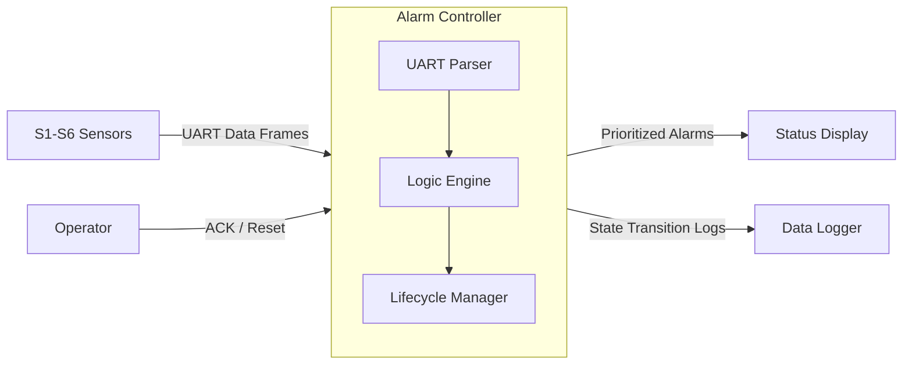
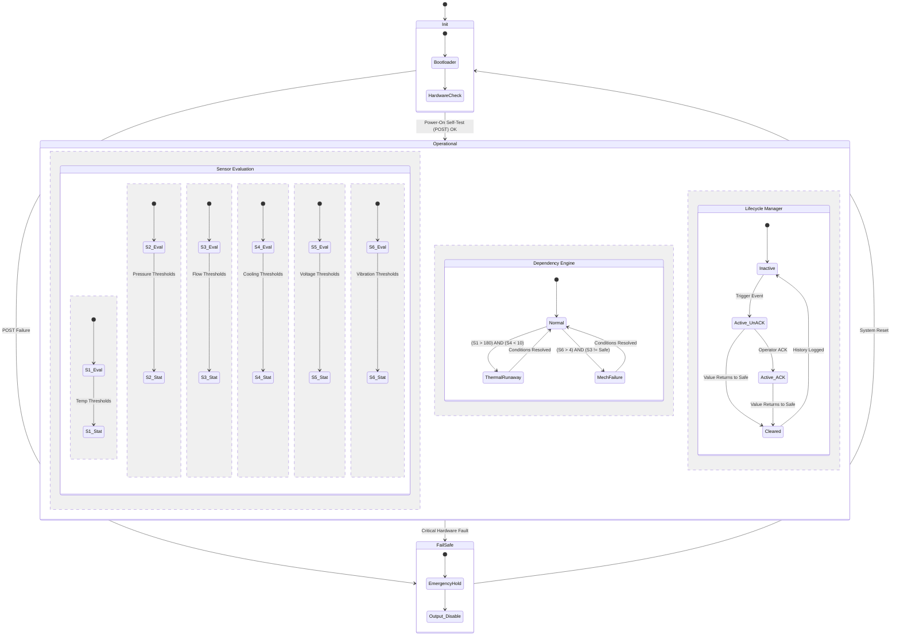

# Alarm Management System (AMS)

## 1. System Boundary

### Inside the System
* **UART Frame Parser:** Validates checksums and extracts sensor IDs/Values.
* **Classification Engine:** Maps raw values to Safe, Caution, or Critical regions.
* **Logic Engine:** Evaluates multi-sensor dependencies (e.g., Thermal Runaway).
* **Alarm Manager:** Handles the lifecycle (UnACK, ACK, Cleared) and prioritization..

### Outside the System
* **Process Sensors (S1–S6):** Sources providing periodic UART updates.
* **UART Physical Layer:** The communication bus (simulated or physical).
* **Operator:** Person interacting with the system to acknowledge or reset alarms.
* **Hardware Watchdog:** External timer to ensure system responsiveness.

---

## 2. System Context

### 2.1 Actors and Interfaces

| Actor / Entity | Type | Interface Description |
|---------------|------|-----------------------|
| **Sensors (S1-S6)** | Input | Provides asynchronous data frames via UART. |
| **Operator** | User | Inputs for Acknowledge (ACK) and Alarm Reset. |
| **Status Display** | Output | Visual interface showing active alarms and priorities. |
| **Logger** | Output | Serial/SD log of all state transitions and timestamps. |

### 2.2 System Context Diagram

## 3. Selected Use Cases

| ID | Use Case | Actor | Description |
| :--- | :--- | :--- | :--- |
| **UC-1** | **Classify Sensor Data** | Sensor | **Goal:** Map raw incoming UART data to a safety region. **Trigger:** Reception of a valid UART frame (e.g., `$SENSOR,ID=S1,VALUE=192.5`). **Action:** Compare value against thresholds (Safe, Caution, Critical) using hysteresis logic. **Outcome:** Sensor state is updated in the global monitoring table. |
| **UC-2** | **Detect Dependency Alarm** | Logic Engine | **Goal:** Identify high-risk scenarios involving multiple sensors. **Trigger:** A change in state of S1 (Temp) or S4 (Cooling Flow). **Action:** Evaluate if `(S1 > 180)` AND `(S4 < 10)`. **Outcome:** If true, raise **A1: Thermal Runaway Risk** (Priority 1). |
| **UC-3** | **Manage Alarm Flood** | Alarm Manager | **Goal:** Prevent operator confusion by suppressing redundant alerts. **Trigger:** A Priority 1 (Critical) alarm becomes active. **Action:** Scan active Priority 2 (Caution) alarms; mask those that are logically subordinate to the Priority 1 event. **Outcome:** Operator display shows only the most severe, actionable alarm. |
| **UC-4** | **Acknowledge Alarm** | Operator | **Goal:** Confirm the operator is aware of the condition. **Trigger:** Operator presses the 'ACK' button or sends an ACK command via UART. **Action:** Change alarm state from `Active (Unacknowledged)` to `Active (Acknowledged)`. Silence audible alerts. **Outcome:** The visual indicator changes from flashing to steady. |
| **UC-5** | **Handle Signal Loss** | UART Bus | **Goal:** Maintain safety when data is missing or malformed. **Trigger:** Watchdog timeout (e.g., no frame for S2 received within 500ms). **Action:** Transition S2 state to **Critical** and raise a "Communication Fault" alarm. **Outcome:** System enters a conservative fail-safe state to protect the process. |

### Use Case Descriptions

#### UC-1: Classify Sensor
- **Goal:** Assign a safety level (Safe/Caution/Critical) to an individual sensor.
- **Trigger:** Valid UART frame received.
- **Main Interaction:** Parse frame → extract value → compare against thresholds with hysteresis.
- **Outcome:** Local sensor state is updated in the system table.

#### UC-2: Trigger Dependency
- **Goal:** Identify high-risk scenarios involving multiple sensors (e.g., Thermal Runaway).
- **Trigger:** A state change in any involved sensor (e.g., S1 or S4).
- **Main Interaction:** Combine Boolean states (e.g., S1 > 180 AND S4 < 10) → trigger Priority 1 alarm.
- **Outcome:** A complex alarm is raised that individual sensors alone wouldn't trigger.

#### UC-3: Suppress Alarm
- **Goal:** Prevent "Alarm Flooding" and operator overload.
- **Trigger:** A Priority 1 (Critical) alarm becomes active.
- **Main Interaction:** Manager checks list of Priority 2/3 alarms → masks related informational alarms.
- **Outcome:** The operator only sees the root-cause critical alarm.

#### UC-4: Acknowledge Alarm
- **Goal:** Operator confirms awareness of a critical condition.
- **Trigger:** Operator presses the ACK button.
- **Main Interaction:** System moves alarm from 'Active-Unacknowledged' to 'Active-Acknowledged' → stops flashing display.
- **Outcome:** Audible/Visual alert is silenced, but the condition remains logged.

#### UC-5: Default to Safety
- **Goal:** Maintain safety when data is missing or malformed.
- **Trigger:** Watchdog timeout (e.g., no frame received > 2s).
- **Main Interaction:** Force sensor state to 'Critical' → trigger "Sensor Fault" alarm.
- **Outcome:** System defaults to the most conservative safety state.

## UML Statechart (Behavioral Model)

## Safety and Error Handling (Behavioral View)
 - Fail-Safe Defaults: If a UART frame is malformed or missing more than 2 cycles, the system assumes the worst-case scenario and triggers a "Sensor Loss" Critical alarm.
 - Priority Escalation: Priority 1 (Critical) alarms are non-suppressible. If multiple Critical alarms trigger, they are queued by timestamp.
 - Determinism: The Operational state logic is executed at a fixed frequency (e.g., 100Hz) to ensure predictable response times regardless of alarm load.
 - State Persistence	Critical alarms are stored in non-volatile memory to survive power cycles and require manual reset.
 
## Change Log

| Date | Change          | Author  |
| ---- | --------------- | ------- |
| 01-02-2026 | Initial version | Desigan PK |
| 01-02-2026 | Updated UML Statechart | Desigan PK |
| 01-02-2026 | Updated safety and Error handling | Sreedhar |
